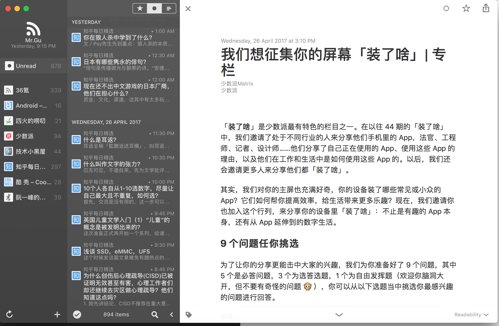

# uwp-RSS-project
现代操作系统期中项目

## Deadline
第12周   5月14日 前 提交成品

## Refference
 1. 相关的解析rss feed的代码实践与结构熟悉
 2. [RSS feed reader implementation in C#](http://czetsuya-tech.blogspot.com/2011/01/rss-feed-reader-implementation-in-c.html), use xmlreader to read the rss
 3. [Best Way to read rss feed in .net Using C#](http://stackoverflow.com/questions/10399400/best-way-to-read-rss-feed-in-net-using-c-sharp),use `System.ServiceModel.Syndication` to read the rss
 4. [How to Parse RSS Feeds in .NET](https://www.codeproject.com/Articles/820669/How-to-Parse-RSS-Feeds-in-NET),use `stringbuilder` to help us construct the rss content
 5. [Creating Your Own RSS Reader In C#](http://www.dreamincode.net/forums/topic/34745-creating-your-own-rss-reader-in-c%23/)非常详细，看起来可以深入浅出地写了整个流程，还提供了源代码，我应该会着重看这一篇教程，需要翻墙。

## 开发日志
### 2017/4/28 UI 1.0 
By Mr.gu
#### 坑：
1. 本次UI还有很多坑没有去填好，一是程序处于飞活动状态时右上角的BUTTON尚未设置；
2. 是响应式布局还没怎么弄
3. 只完成了简单的XAML编程，并无数据绑定，这需要框架~
4. WEBVIEW没研究过，这需要实现RSS的时候再弄
5. 具体需要在UI上呈现的后台数据面对面讨论

#### 特点：
1. 学习了用STYLE文件去统一定义样式的方法，虽然现在还有很多样式定义在XAML里
2. 将控件嵌入了Title bar
3. 学习了对BUTTON的控件自定义

#### 参考：


 Good artists copy great artists steal. 	 ---Steve Jobs

 ----
 ### 2017/04/30
 By longj
 #### 相关学习资料
 1. 相关的解析rss feed的代码实践与结构熟悉
    2.[RSS feed reader implementation in C#](http://czetsuya-tech.blogspot.com/2011/01/rss-feed-reader-implementation-in-c.html), use xmlreader to read the rss
    3.[Best Way to read rss feed in .net Using C#](http://stackoverflow.com/questions/10399400/best-way-to-read-rss-feed-in-net-using-c-sharp),use `System.ServiceModel.Syndication` to read the rss
    4.[How to Parse RSS Feeds in .NET](https://www.codeproject.com/Articles/820669/How-to-Parse-RSS-Feeds-in-NET),use `stringbuilder` to help us construct the rss content
    5.[Creating Your Own RSS Reader In C#](http://www.dreamincode.net/forums/topic/34745-creating-your-own-rss-reader-in-c%23/)非常详细，看起来可以深入浅出地写了整个流程，还提供了源代码，我应该会着重看这一篇教程，需要翻墙。

### 2017/05/04
1. [We can get general Rss structure in this article](https://www.w3schools.com/xml/xml_rss.asp)
So the general structure of Rss request is:
```xml
<?xml version="1.0" encoding="UTF-8" ?>
<rss version="2.0">

<channel>
  <title>W3Schools Home Page</title>
  <link>https://www.w3schools.com</link>
  <description>Free web building tutorials</description>
  <item>
    <title>RSS Tutorial</title>
    <link>https://www.w3schools.com/xml/xml_rss.asp</link>
    <description>New RSS tutorial on W3Schools</description>
  </item>
  <item>
    <title>XML Tutorial</title>
    <link>https://www.w3schools.com/xml</link>
    <description>New XML tutorial on W3Schools</description>
  </item>
</channel>
</rss>
```
So we maybe can use one parse function to decode different Rss feed.

2. 更新出来整个程序的总体结构，请见文件夹下的相关照片
---
### 2017/5/4  增加了一些小部件
By Mr.gu

#### 进度：
1. 设置了圆角
2. 完成了中间控件的设计
3. 添加了content dialog设计， 完成点击ADD号弹出的UI